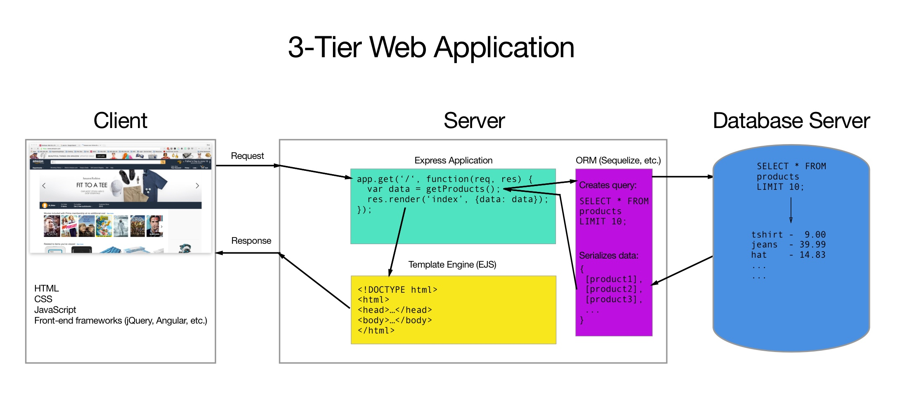

# Intro to Node

## Objectives
* Describe Node and Node Package Manager
* Set up a basic Node project
* Create, export, and import Node modules
* Use NPM to install and save node packages
* Describe what data is found in package.json

## Full Stack with Node and Express

Node is a runtime environment for running JavaScript, and it allows us to create applications where both the client and server use JavaScript. Specifically, we'll use a web framework called Express in order to create a secure web server that interacts with a database.

By the end of this unit, we'll have designed a 3-tier application similar to this.



## Review: Client-Server

* What's the front-end (client side)?
  * Broswer
  * User interface
  * Html, CSS, Javascript
* What's the back-end (server-side)?
  * what's going on behind the scenes
  * data transactions/business logic
    * C - sign up for a facebook account
    * R - display all of your facebook friends
    * U - change your facebook password
    * D - delete your facebook account
* Why do we need a back-end?
  * efficiency and security
    * lighten up front end load
    * manage data securely

## Node
Node is a platform that uses JavaScript for creating network applications.

But wait! Isn't Javascript is a _front-end_ language written for browsers? Yes! This is the beauty of Node. It gives us a server-side environment that can handle logic written in Javascript. It allows JavaScript to be run on a server.

We'll see that there are functions and patterns unique to Node (for example, the `require` function in Node, which is not available in the browser).

### Install Node

We will use Homebrew to install Node via the command line.

#### 1. update Homebrew with the latest version of Node
```brew update```

#### 2. install Node on your machine (this may take a few minutes)
```brew install node```

#### 3. verify that Node was installed by checking the version that is on your machine
```node -v```


### Setting up a Node Project

#### 1. Create a new folder for your first node project.
```mkdir my-first-node-proj```

Open the folder in your favorite text editor.

#### 2. Initialize Node inside the project folder.

(check the command line prompt to make sure you're actually inside the project folder)
```
npm init
```

You will be prompted to enter values for a number of fields to set up the node project. You can just press enter to accept the default value, or enter specific values if you'd like.

To skip this step in the future (and accept all default values at once), type ```npm init -y```.

Take a look at the ```package.json``` file that was just created. This is where the values we just set up via ```npm init``` are stored. This is like your _settings_ file. You can edit these values by changing them in this file (make sure to save).

#### 3. Make your entry point.

Unless you specified a different file name in setup (check the ```main``` value in ```package.json```), Node will look for a file called ```index.js``` as the entry point for running your project. This file holds the code to be executed - this is the heart of your program. Create this file now.

```touch index.js```

Let's write some code in here and run it to see Node in action! Write the following line to your ```index.js```:

```console.log("Hello world!")```

#### 4. Run your program!

To run a file in node via the command line, type ```node [file name here]```.

```node index.js```

Congratulations, you've created and run your first Node program! Let's learn more about how Node is used in the wild (and eventually, in the web-development context).
