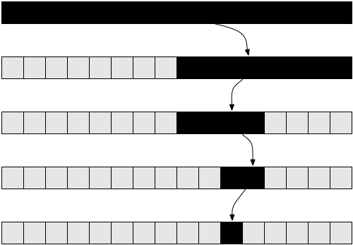

# Binary Search

Binary search is an efficient algorithm for finding elements in a sorted array. It's important that the array is sorted. Binary Search will not work on unsorted arrays.

## Searching With "Guesses"

Binary Search finds items quickly by "guessing" an array index where an element might be, reading the value at that index, and basing it's next guess on what value it read. If the value at the index was less than the value it's searching for its next guess will be a higher index. It chooses a lower index if the value read was higher than what it is looking for. This is why it needs to be sorted.

## Consider How You Use Phonebooks

Imagine flipping through a phone book to find someone's number. A linear algorithm (like looping through each element in an array) would start at the beginning of the phone book and read every name on every page until it found the name you're looking for. This is terribly slow!

Instead of reading every single name it's much easier to read one random name and flip forward or backward depending on how close that name is to the name you're looking for.

This only works because the phone book is sorted by names. Imagine trying to do a reverse look up on a mysterious phone number using a phone book. You'd have to start at the beginning and look at every single entry!

### How Fast is Fast?

Imagine we had an array where every array access took 1 second. No matter what index we read it would take a full second for us to get the value. It would take us one minute to read every item in an item with only 60 items in it.

How long is a trillion seconds?

* 1,000 seconds is equal to almost 17 minutes.
* It would take almost 12 days for a million seconds to elapse
* It takes about 31.7 years for a billion seconds to go by.
* A trillion seconds amounts to no less than 31,709.8 years.

It would take practically 31,709 years to search iteratively through an array with one trillion items.

With binary search it would take only 40 guesses to find the correct index. Binary Search reduced the runtime of searching for something in the trillion-length array from 31,709 years to only 40 seconds!

Binary Search is extremely fast.

## Why is it So Fast?

Each time the algorithm recurses, it eliminates half of the remaining elements in the array from the search. Obviously, this requires fewer lookups and comparisons than iterating over every element. It doesn't really pay off for small arrays but for very large arrays, the time savings is exponential. Here is a diagram showing the ever-decreasing search range in binary search:

## The Algorithm

Your task is to implement this algorithm in Python. Algorithms like these are language independent, meaning the language syntax may change but the logical flow is always the same. Binary Search is a recursive function and it runs until it finds the index of the value being searched for or until the portion of the array it is searching contains no elements.

* Function takes four parameters: the array (`arr`), the search value (`val`), the starting index (`start`), and the ending index (`end`).
* `start` and `end` are [optional parameters](https://developer.mozilla.org/en-US/docs/Web/JavaScript/Reference/Functions/Default_parameters) (for the first call). Give `start` a default value of 0 and give `end` a default value of `null`.
* Inside your function, you must detect if `end` is `null`. If it is, you need to then set it to `arr.length -1` so it holds the last index in gthe array.

1. Find the index midway between `start` and `end`. (Not important if it isn't exactly midway.)
2. Compare the value at the `mid` index to the value (`val`) being searched for.
3. If it matches, return that index (`mid`).
4. If the value at `mid` is greater than `val` then recurse on the left half of the array.
  * Call `binarySearch` again with the same `arr` and the same `val` but change the `start` and `end`:
  * For the left half, use the same index for `start` but use `mid - 1` for the `end` value.
5. if the value at `mid` is less than `val` then recurse on the right half of the array.
  * Call `binarySearch` again with the same `arr` and `val` but change `start` and  `end`:
  * For the right side, use `mid + 1` for `start` and use the existing index in `end`.
6. If ever your `start` index is greater than your `end` index, you are immediately done. Return `-1` to indicate that the value was not found in the array.

## Implement It!